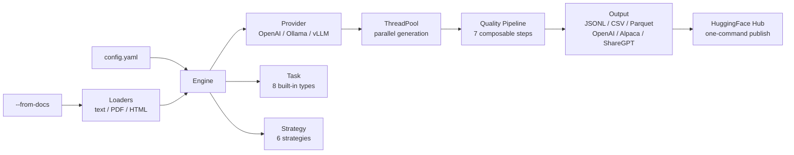

# dataset-generator

[](https://www.python.org/downloads/)
[](LICENSE)
[]()
[]()

**Turn any LLM into a dataset factory.** Generate high-quality synthetic training data for classification, NER, QA, SFT, DPO, and more — using OpenAI, Ollama, vLLM, or any OpenAI-compatible API.

---

## 🚀 Quick Start

```bash
pip install dataset-generator

# Generate 100 classification samples with one command (no config file needed)
dg generate --task classification --labels "positive,negative,neutral" --domain "product reviews"

# Or scaffold a config for full control
dg init classification --labels "positive,negative,neutral"
dg generate
```

**What you get** — `data/output.jsonl`:

```json
{"text": "The battery life on this laptop is incredible, easily lasting 12 hours.", "label": "positive"}
{"text": "Returned it after a week. The screen had dead pixels on arrival.", "label": "negative"}
{"text": "The package arrived on Tuesday as scheduled.", "label": "neutral"}
```

Use any provider — just set env vars:

```bash
# OpenAI
DG_BASE_URL=https://api.openai.com/v1 DG_API_KEY=sk-... DG_MODEL=gpt-4o dg generate

# Ollama (local, free — the default)
dg generate

# vLLM, Together, Groq, LiteLLM — anything OpenAI-compatible
DG_BASE_URL=https://api.together.xyz/v1 DG_API_KEY=... DG_MODEL=meta-llama/Llama-3-70b dg generate
```

> **Local models:** When using localhost (Ollama, vLLM), the tool auto-detects and sets `max_workers=1` and `batch_size=5` to avoid overwhelming a single GPU. Override with `--max-workers` / config if you have multi-GPU.

---

## 📡 Why This Tool?

You need labeled training data. Your options are: hire annotators (slow, expensive), hand-write examples (tedious), or prompt an LLM and copy-paste (unscalable). `dataset-generator` automates the third option with **parallel generation, deduplication, quality filtering, cost tracking, and direct HuggingFace Hub publishing** — all from a single command.

| Feature | What it does |
|---------|-------------|
| **8 task types** | Classification, NER, QA, preference/DPO, SFT, conversation, summarization, distillation |
| **6 strategies** | Direct, few-shot, persona, chain-of-thought, adversarial, evol-instruct |
| **7 quality steps** | Dedup, validation, PII removal, language detection, toxicity filtering, balance, diversity |
| **7 output formats** | JSONL, CSV, Parquet, HuggingFace, OpenAI fine-tune, Alpaca, ShareGPT |
| **Document grounding** | Generate from your own docs (`--from-docs ./papers/`) |
| **Cost-aware** | Token tracking, budget caps (`--max-cost 5`), dry-run estimates |
| **Resumable** | Checkpoint long runs, resume with `--resume` |
| **One-command publish** | `dg push user/my-dataset` with auto-generated dataset cards |

---

## 🔗 CLI Reference

```bash
dg init <task>              # Scaffold config for any of 8 task types
dg generate                 # Generate dataset from config
dg generate --from-docs .   # Ground generation on local documents
dg generate --max-cost 5    # Set a $5 budget cap
dg generate --resume        # Resume from last checkpoint
dg generate --dry-run       # Estimate cost without running
dg validate <file>          # Deduplicate and validate existing dataset
dg export <file> -f parquet # Export to any supported format
dg push user/my-dataset     # Publish to HuggingFace Hub with auto dataset card
dg info                     # Show available tasks, strategies, and formats
```

<details>
<summary>Inline generation (no config file needed)</summary>

```bash
# SFT dataset for coding
dg generate --task sft --domain "Python programming" --strategy persona -n 500

# QA pairs grounded on your documents
dg generate --task qa --from-docs ./papers/ -n 200

# DPO preference pairs
dg generate --task preference --domain "customer support" --strategy adversarial -n 1000

# Multi-turn conversations
dg generate --task conversation --domain "tech support" -n 100

# NER with custom entity types
dg generate --task ner --entity-types "FOOD,DRINK,RESTAURANT" --domain "restaurant reviews" -n 500
```

</details>

---

## 📋 Configuration

All settings live in `config.yaml`. Environment variables use `${VAR:-default}` syntax.

```yaml
provider:
  kind: openai
  base_url: ${DG_BASE_URL:-http://localhost:11434/v1}
  api_key: ${DG_API_KEY:-ollama}
  model: ${DG_MODEL:-llama3.1:8b}

type: classification
task:
  labels: ["positive", "negative", "neutral"]
  domain: "product reviews"

generation:
  num_samples: 1000
  batch_size: 10
  max_workers: 20
  temperature: 0.7
  strategy: persona

# Optional: ground generation on your own documents
# from_docs: ./docs

# Optional: quality pipeline steps beyond dedup + validation
# quality:
#   steps:
#     - pii: {action: remove}
#     - language: {expected: en, action: remove}
#     - toxicity: {action: flag}
```

<details>
<summary>All config options</summary>

| Section | Key | Default | Description |
|---------|-----|---------|-------------|
| `provider` | `kind` | `openai` | Provider type (openai, ollama, vllm, litellm, together, groq) |
| `provider` | `base_url` | `http://localhost:11434/v1` | API endpoint |
| `provider` | `api_key` | `ollama` | API key |
| `provider` | `model` | `llama3.1:8b` | Model name |
| `provider` | `timeout` | `600` | Request timeout in seconds |
| `generation` | `num_samples` | `100` | Target sample count |
| `generation` | `batch_size` | `10` | Samples per LLM call |
| `generation` | `max_workers` | `10` | Parallel requests |
| `generation` | `max_retries` | `3` | Retries per batch |
| `generation` | `temperature` | `0.7` | Sampling temperature |
| `generation` | `strategy` | `direct` | Generation strategy |
| `generation` | `max_cost` | — | Budget cap in USD |
| `from_docs` | — | — | Path to docs for grounded generation |
| `quality` | `similarity_threshold` | `0.85` | Fuzzy dedup threshold |
| `quality` | `min_length` | `10` | Min text length (chars) |
| `quality` | `max_length` | `10000` | Max text length (chars) |
| `quality` | `steps` | `[]` | Quality pipeline steps (pii, language, toxicity, balance, diversity) |
| `output` | `path` | `data/output.jsonl` | Output file path |
| `output` | `format` | `jsonl` | Output format |

</details>

---

## 🐍 Python API

```python
from dataset_generator import generate, load_config, export

# One-liner from config
samples = generate(config_path="config.yaml")

# Programmatic control
config = load_config("config.yaml")
config["generation"]["num_samples"] = 5000
samples = generate(config=config)

# Export to any format
export(samples, "data/output.parquet", fmt="parquet")
```

---

## 📤 Output Formats

| Format | File | Use case |
|--------|------|----------|
| `jsonl` | `.jsonl` | General purpose, streaming-friendly |
| `csv` | `.csv` | Spreadsheet analysis, quick inspection |
| `parquet` | `.parquet` | Columnar storage, efficient for large datasets |
| `huggingface` | Arrow dir | Direct `datasets.load_from_disk()` |
| `openai` | `.jsonl` | OpenAI fine-tuning (`{"messages": [...]}`) |
| `alpaca` | `.json` | Alpaca format (`instruction` / `input` / `output`) |
| `sharegpt` | `.jsonl` | ShareGPT format (`{"conversations": [...]}`) |

---

## 🏗️ Architecture



<details>
<summary>Project structure</summary>

```
src/dataset_generator/
├── cli.py                # `dg` command (Typer)
├── config.py             # YAML + env var substitution
├── engine.py             # Orchestrator (concurrency, retries, cost tracking)
├── formats.py            # Output serialization (7 formats)
├── checkpoint.py         # Resume long runs from checkpoint
├── hub.py                # HuggingFace Hub publish + dataset cards
├── providers/
│   ├── base.py           # Provider protocol + CompletionResult
│   └── openai_compat.py  # OpenAI-compatible (covers 90% of providers)
├── tasks/
│   ├── classification.py
│   ├── ner.py
│   ├── qa.py
│   ├── preference.py
│   ├── sft.py
│   ├── conversation.py
│   ├── summarization.py
│   └── distillation.py
├── strategies/
│   ├── direct.py
│   ├── few_shot.py
│   ├── persona.py
│   ├── cot.py
│   ├── adversarial.py
│   └── evolinstruct.py
├── loaders/              # Document loaders for --from-docs
│   ├── text.py
│   ├── pdf.py
│   └── html.py
└── quality/              # Composable QualityStep pipeline
    ├── pipeline.py
    ├── dedup.py
    ├── validate.py
    ├── pii.py
    ├── balance.py
    ├── language.py
    ├── toxicity.py
    └── diversity.py
```

</details>

---

## 🛠️ Development

```bash
make setup      # Install all deps
make quality    # Lint + test (run before commits)
make format     # Auto-fix formatting
make test       # Tests only
make clean      # Remove build artifacts
```
